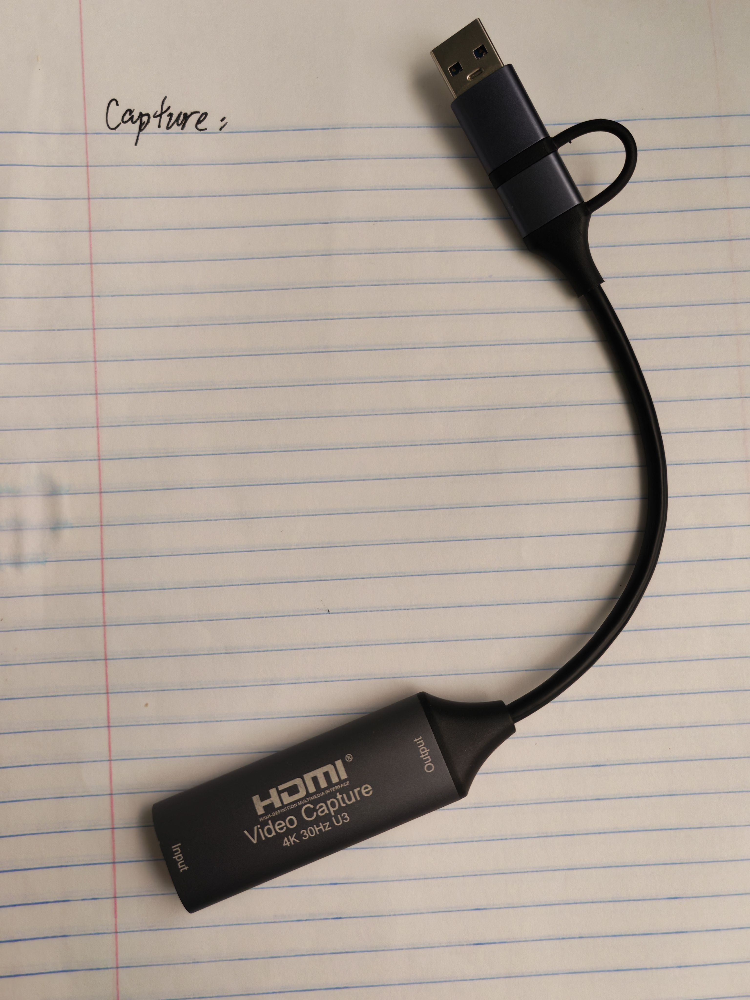

# CSE-5### Game Footage Capture
- Captured using OBS Studio at 1080p, 30 FPS, with a capture card

- Each clip is 10–20 seconds long and showcases crowded street scenes.
- Videos are stored in MP4 format (H.264 encoding).V-Term-Project

## Introduction
This project aims to detect and track pedestrians and vehicles in a gameplay video of *Cyberpunk 2077* using classical computer vision algorithms. Neural networks are strictly avoided. Challenges include occlusion, appearance drift, scale variation, and diverse motion speeds.

## Pre-production

### Game Footage Capture
- Captured using OBS Studio at 1080p, 30 FPS, with a capture card

- Each clip is 10–20 seconds long and showcases crowded street scenes.
- Videos are stored in MP4 format (H.264 encoding).

### Environment Setup
- OS: Ubuntu 22.04 / Windows 10
- Dependencies:
  - OpenCV 4.x
  - NumPy
- To set up and run:
  ```bash
  python3 -m venv venv
  source venv/bin/activate
  pip install -r requirements.txt
  ```

## Design and Implementation


## Execution

1. Place video clips in the `data/` folder.
2. Run the pipeline:

   ```bash
   python main.py --input data/cyberpunk.mp4 --output results/
   ```
3. Optional flags:

   * `--max-trackers`: maximum number of tracked targets
   * `--reinit-interval`: frame interval for reinitialization

## Results


## Analysis


## Conclusion

This project demonstrates the viability of multi-object tracking in real-world footage using classical computer vision techniques. Despite the lack of deep learning, performance remains strong. Future work may involve smarter re-identification, occlusion modeling, or hybrid learning-free tracking enhancements.
