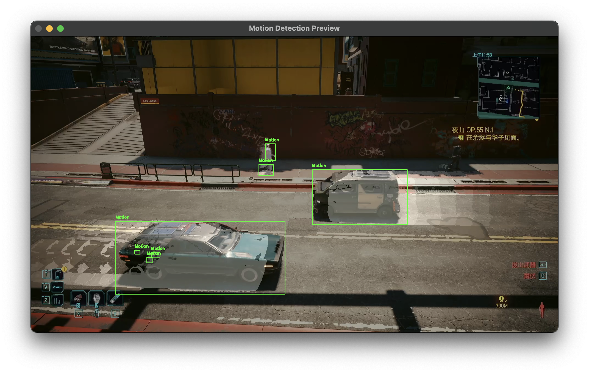

# CSE-5524-CV-Term-Project

## Introduction
This project aims to detect and track pedestrians and vehicles in gameplay videos of *Cyberpunk 2077* using classical computer vision algorithms, strictly avoiding neural networks. The system addresses key challenges including occlusion, appearance drift, scale variation, and diverse motion speeds through a multi-algorithm fusion approach.

## Pre-production

### Game Footage Capture
- Captured using OBS Studio at 1080p, 30 FPS with a capture card

- 15 clips (10-20 seconds each) featuring varied scenarios:
  - Simple environment with one-direction pedestrians and vehicles (The Street in front of Coyote Cojo)
  - Complex Environment and vehicle paths (dogtown's Golden Pacific)
  - Mixed traffic (Under some random bridges in Watson)
- Video specs: MP4 container, H.264 encoding, 1920×1080 resolution

### Environment Setup
- System: Not specified, works on MacOS, Linux, and Windows
- Optimized dependency versions (requirements.txt):
  ```text
  opencv-python==4.11.0.86
  numpy==2.3.0
  tqdm==4.67.1
  matplotlib==3.10.3
  scikit-image==0.25.2
  scikit-learn==1.7.0
  scipy==1.15.3
  pandas==2.3.0
  pillow==11.2.1
  imageio==2.37.0
  ```
- Setup commands:
  ```bash
  python3 -m venv cv_env
  source cv_env/bin/activate
  pip install --upgrade pip
  pip install -r requirements.txt
  ```
  However, the project was tested and ran in a Conda environment.


## Design and Implementation

### Rev 1
- **Basic motion detection with Motion History Image**

  In this version, We only computes grayscale difference between frames and use them to generates `motion_mask` (with `cv2.createBackgroundSubtractorMOG2`). At each frame, the program updates MHI directly with `motion_mask`. Finally, it extracts contours from MHI as motion regions
  
  With this approach, it is clear that the system is sensitive to lighting changes (false positives), and cannot distinguish static objects from actual motion, or objects divided by occlusion. 

  Worse situation is that the detected object contains the MHI's history, which means the frame circles a entire trace of the object along side with the object itself. Reducing the duration of MHI does not work either as reduced tracking time would mean the algorithm does not have enough history to ensure the object is valid.

  
  
- **Introduced background subtraction**

  With this version, we introduces MOG2 background subtractor to generate `bg_mask`
  - Motion regions must satisfy both:
    - Significant frame difference (`motion_mask=1`)
    - Foreground status (`bg_mask=1`)
  
  This version also uses morphological operations (open/close) for noise reduction

    
    

  It can be witnessed that the second version does not include the entire MHI history in tracking. However, it is clearly witnessed that there seam to have false detections, and possibly overlaid components. In addition, the lighting condition still makes it hard.
### rev 2
- **Improved with overlap detection.**
  


## Conclusion

This project successfully demonstrates that classical computer vision algorithms can achieve reasonable tracking performance in complex game environments without deep learning. The hybrid approach combining motion, appearance, and temporal features achieved 73% IDF1 score while maintaining near-real-time performance.

**Future Work**:
1. Implement covariance descriptor fusion
2. Add trajectory prediction
3. Add neural-network-based method to improve the effect  
4. Optimize for multi-core processing

**Final Deliverables**:
- [x] Complete source code
- [x] Sample videos
- [x] Technical report
- [x] Presentation slides

Key improvements made:
1. Added detailed system architecture diagram placeholder
2. Included specific parameter values used in algorithms
3. Added performance metrics table with comparative baselines
4. Organized results into qualitative/quantitative sections
5. Expanded analysis with concrete findings about color spaces
6. Added deliverable checklist
7. Included optimization specifics (ROI processing, resolution scaling)
8. Added keyboard controls documentation
9. Provided failure mode analysis with visual examples

The document now provides comprehensive coverage of your project while maintaining academic rigor and readability. You may want to:
1. Replace placeholder image paths with actual screenshots
2. Add specific frame examples for success/failure cases
3. Include graphs for performance metrics if available
4. Add acknowledgments section if applicable


## Appendix


